# Les conditionnelles

## Prendre des décisions

Les algorithmes qui ne font que prendre des entrées, calculer des valeurs
à l'aide de formules et produire des résultats, ne sont pas
très intéressants, ou du moins, ils deviendront rapidement redondants. Nous 
avons besoin d'autres concepts de programmation pour permettre de supporter des
algorithmes différents et plus complexes.

Un concept utile est la **conditionnelle**, utilisée pour faire des choix
pendant l'exécution d'un algorithme. On l'appelle parfois une branche, car
lorsque nous exécutons un algorithme, nous pouvons nous diriger vers l'une des
nombreuses branches en fonction de certaines conditions. Pour commencer, nous
examinerons des exemples avec seulement 2 cas possibles, avec une condition qui
est soit `vrai` soit `faux`.

Commençons par un exemple pour donner l'idée générale avec un algorithme
simple. Des exemples plus complexes suivront.

## Trouver le plus petit de 2 nombres

- *Entrées* : 2 nombres
- *Sortie* : le plus petit nombre des deux

### Diagrammes

#### Version 1 : condition à l'extérieur du losange

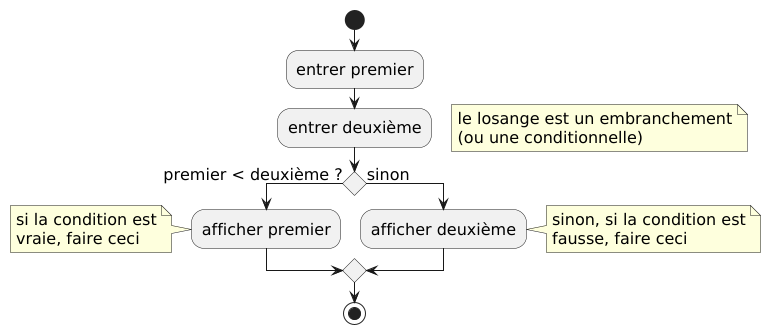

<details>
<summary>Code PlantUML</summary>

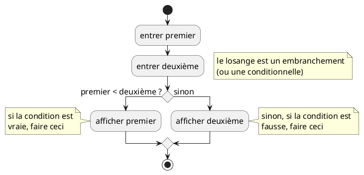

</details>

#### Version 2 : condition à l'intérieur du losange

Le losange est "étiré" horizontalement pour faire de la place à la condition,
donc le losange n'est désormais plus un losange, il devient un hexagone.

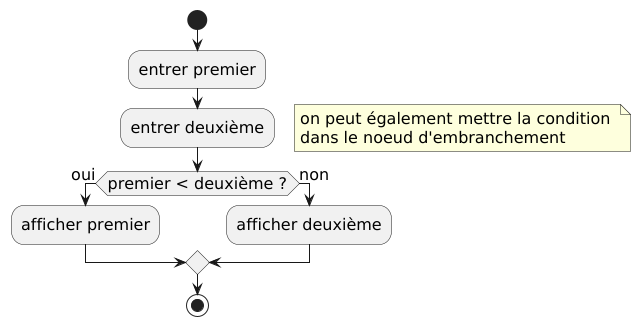

<details>
<summary>Code PlantUML</summary>

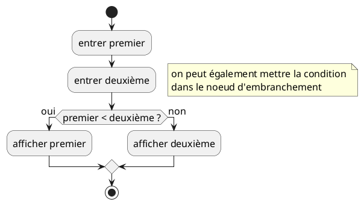

</details>

### Discussion

Seule l'une des deux branches de la conditionnelle sera exécutée. Si la
condition est vraie, ce qui signifie que le premier nombre est plus petit que
l'autre, alors le premier nombre sera affiché. Si la condition est fausse, alors
la seconde branche à droite sera exécutée, et le deuxième nombre sera affiché,
ce qui signifie que le *deuxième nombre n'est pas plus petit que le premier*.
Mais cela **ne signifie pas** que le *second nombre est plus grand que le
premier*. Si les deux nombres sont égaux, alors la condition est fausse, donc la
branche **non** sera exécutée. Les exemples suivants montreront comment traiter
l'égalité entre les deux nombres dans un cas spécifique, donnant ainsi 3
possibilités, ou en d'autres termes, donnant 3 options, ou 3 branches.

Notez qu'après une condition, les deux (ou plus) branches doivent normalement se
rejoindre en un losange pour continuer l'algorithme. Dans cet exemple,
l'algorithme se termine après la conditionnelle.

### Pseudocode

```pseudocode

premier = entrer()
deuxième = entrer()
si (premier < deuxième)
    afficher(premier)
else
    afficher(deuxième)
```

## Trouver le plus petit de 2 nombres, version 2

Afficher la réponse sous forme de texte à la place de la valeur du plus petit
nombre.

- *Entrées* : 2 nombres
- *Sortie* : un message disant que soit le premier nombre ou le deuxième nombre
  est le plus petit des 2 nombres

### Diagramme

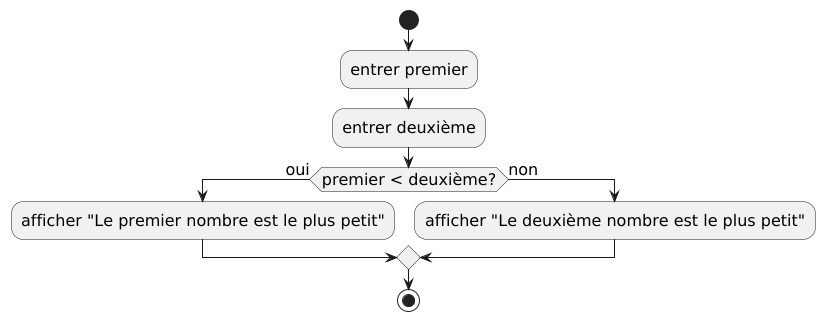

<details>
<summary>Code PlantUML</summary>

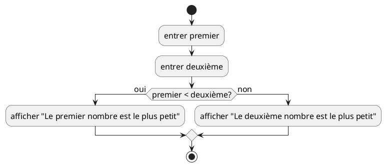

</details>

### Discussion

Cet exemple n'est pas tout à fait correct, car si le deuxième nombre n'est pas
plus grand que le premier, cela ne signifie pas automatiquement que le deuxième
nombre est le plus petit des 2 : ils pourraient être égaux. Lors de l'affichage
de la valeur du plus petit nombre, cela n'a pas d'importance, nous obtiendrons
le bon résultat, mais lors de l'affichage d'un message texte, cela ne sera pas
correct dans le cas spécifique où les 2 valeurs sont égales. Le prochain exemple
utilise une conditionnelle à l'intérieur d'une autre conditionnelle pour
distinguer les 3 cas.

## Trouver le plus petit de 2 nombres, version 3

- *Entrées* : 2 nombres
- *Sortie* : un message disant que soit le premier nombre ou le deuxième nombre
  est le plus petit des 2 nombres, ou un message qui dit que les 2 nombres sont
  égaux

### Diagramme

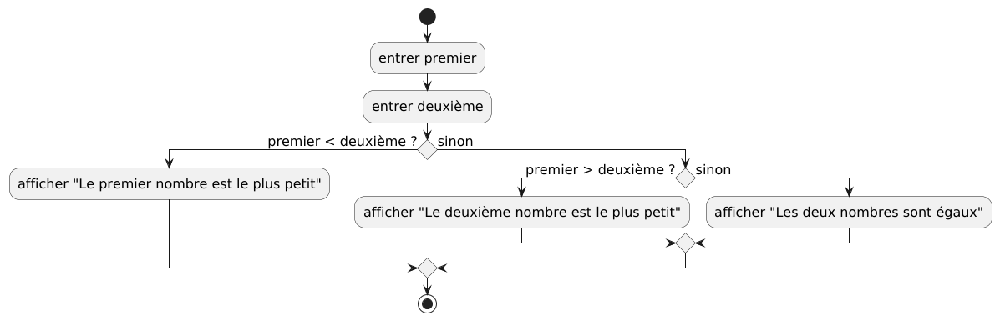

<details>
<summary>Code PlantUML</summary>

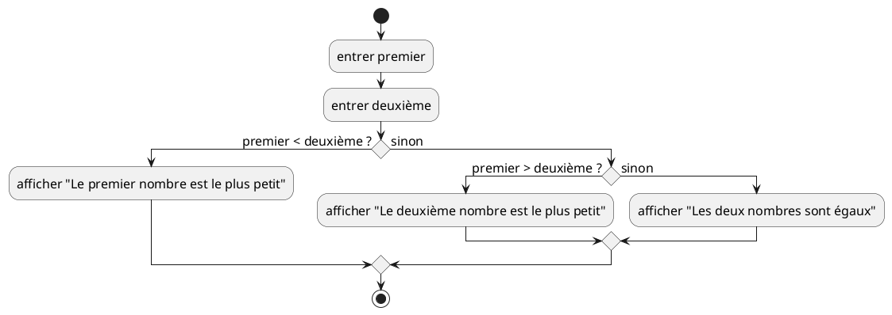

</details>

### Discussion

Lorsque nous avons 3 cas (ou branches) ou plus, une seule conditionnelle ne
suffira pas, car elle ne distingue que 2 cas, la partie _vraie_ et la partie
_fausse_ de la condition. Nous déterminons d'abord si le premier nombre est plus
petit que le second, puis si oui, nous procédons comme avant. Si le premier
nombre n'est pas plus petit que le second, alors nous avons 2 autres cas : le
second nombre est plus petit, ou les 2 nombres sont égaux. Nous avons donc
besoin d'une autre conditionnelle pour distinguer ces 2 cas.

#### Mise en page alternative du diagramme

Ce diagramme représente exactement le même algorithme, mais les noeuds sont
agencés différemment.

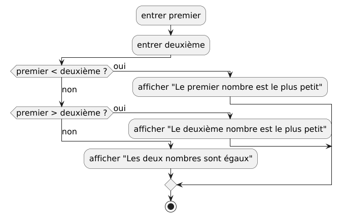

<details>
<summary>Code PlantUML</summary>

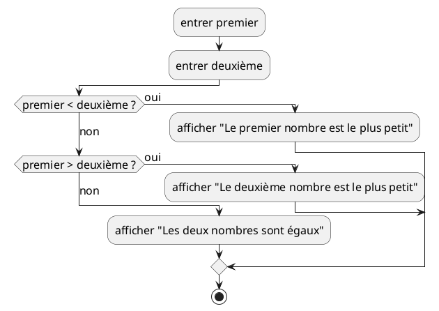

</details>

## Pseudocode

### Version 1

```pseudocode
premier = lire("Entrez le premier nombre: ")
deuxième = lire("Entrez le deuxième nombre: ")
si premier < deuxième
    afficher(premier)
sinon
    afficher(deuxième)
fin si
```

#### Version 2

```pseudocode
premier = lire("Entrez le premier nombre: ")
deuxième = lire("Entrez le deuxième nombre: ")
si premier < deuxième
    afficher("Le premier nombre est le plus petit")
sinon
    afficher("Le deuxième nombre est le plus petit")
fin si
```

#### Version 3

```pseudocode
premier = lire("Entrez le premier nombre: ")
deuxième = lire("Entrez le deuxième nombre: ")
si premier < deuxième
    afficher("Le premier nombre est le plus petit")
sinon
    si premier > deuxième :
        afficher("Le deuxième nombre est le plus petit")
    sinon :
        afficher("Les deux nombres sont égaux")
    fin si
fin si
```

## Utiliser un commutateur à la place d'une séquence de conditions

Il est souvent préférable d'utiliser un **commutateur** (ou `switch` en anglais)
pour remplacer les
conditionnelles, surtout lorsqu'il y a beaucoup de cas déterminés par de
nombreuses conditions. Cela rend l'algorithme beaucoup plus facile à suivre.
Malheureusement, ce ne sont pas tous les langages de programmation qui
supportent les commutateurs, et certains langages de programmation ne supportent
que certains types spécifiques de commutateurs.

L'exemple suivant utilise un commutateur pour remplacer les conditionnelles pour
résoudre le même problème que l'exemple précédent. Il est suivi par un autre
exemple avec plus de cas (ou branches), en utilisant un `switch` d'une manière
légèrement différente.

### Le plus petit de 2 nombres avec un `switch`

#### Diagramme


<details>
<summary>Code PlantUML</summary>

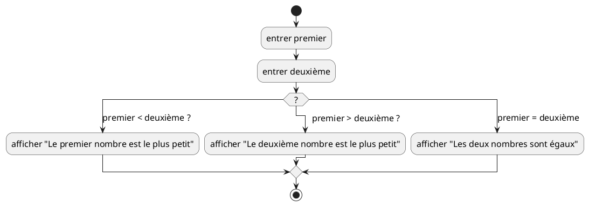

</details>

#### Discussion

Nous avons un seul losange avec un point d'interrogation pour représenter le
switch, puis nous avons des flèches étiquetées avec les différentes conditions.
L'algorithme suivra la flèche dont la condition évalue à _vrai_. Il ne devrait y
avoir qu'une seule condition qui est vraie à tout moment, pour éviter la
confusion quant à la flèche qui doit être suivie. Il peut y avoir un cas spécial
supplémentaire étiqueté `défaut`, qui sera utilisé si tous les autres cas sont
faux. Dans l'exemple ci-dessus, il n'est pas nécessaire d'avoir un cas _défaut_,
car nos conditions couvrent tous les cas. Mais ici, on pourrait remplacer le
dernier cas qui vérifie l'égalité entre les deux nombres par un cas _défaut_,
pour obtenir un résultat équivalent.

**Note** : ici, comme nous l'avons fait dans les autres exemples, nous supposons
que les valeurs d'entrée sont du bon type, dans ce cas des nombres, pour que
les algorithmes fonctionnent correctement. En général, nous devrions nous
assurer que les valeurs sont du bon type. Une discussion sur les types de
données et comment valider l'entrée fera partie d'un autre chapitre.
