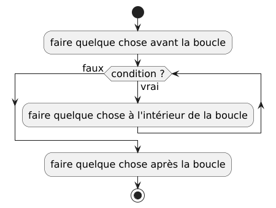
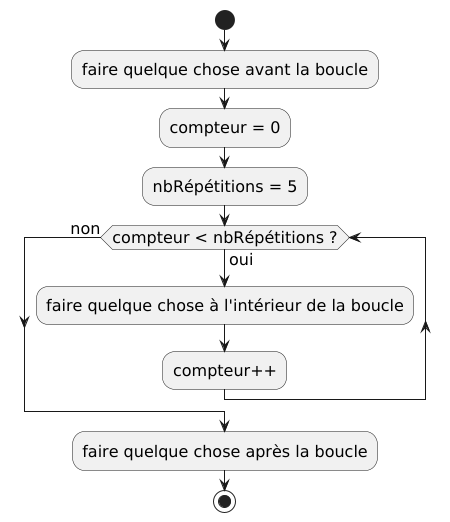

# Les boucles

## Boucles sans compteurs

Les boucles sans compteurs sont basées seulement sur une condition, et ne
comptent pas le nombre de fois que la boucle est répétée. Pas opposition, les
boucles avec compteurs comptent le nombre de répétitions de la boucle, et la
décision de répéter la boucle ou non est basée sur le nombre de répétitions
conservé dans le compteur.

### Boucle `répéter ... jusqu'à`

En anglais : `repeat ... until`.

On place une conditionnelle à la fin de ce qui doit être répété (à la fin de
la boucle). La boucle arrête quand la condition du `jusqu'à` est vraie, et
la boucle continue si la condition est fausse.

Donc le retour arrière vers le début de la boucle s'effectue quand la
condition est fausse. Quand la condition est vraie, on sort de la boucle.


<details>
<summary>PlantUML code</summary>


</details>

````pseudocode
// faire quelque chose avant la boucle
répéter
    // faire quelque chose à l'intérieur de la boucle
jusqu'à condition
// faire quelque chose après la boucle
````

### Boucle `faire ... tant que`

En anglais : `do ... while`.

On place une conditionnelle à la fin de ce qui doit être répété (à la fin de
la boucle). La boucle arrête quand la condition du `while` est fausse, et
la boucle continue si la condition est vraie.

Donc le retour arrière vers le début de la boucle s'effectue quand la
condition est vraie. Quand la condition est fausse, on sort de la boucle.


<details>
<summary>PlantUML code</summary>


</details>

````pseudocode
// faire quelque chose avant la boucle
faire
    // faire quelque chose à l'intérieur de la boucle
tantque condition
// faire quelque chose après la boucle
````

### Boucle `tant que`

En anglais : `while`.

La boucle `tant que` est différente des 2 autres parce que la condition est
placée au début de la boucle, et par conséquent, la condition de boucle est
évaluée _avant_ de faire quoi que se soit dans le corps la boucle. Le corps
d'une boucle `tant que` peut ne jamais être exécutée, mais le corps des
boucles `faire ... tant que` et `répéter ... jusqu'à` sont toujours exécutés au
moins une fois.

Mais comme la boucle `faire ... tant que`, la boucle continue si la condition
est **vraie** et arrête lorsque la condition est **fausse**. La différence est
qu'à la fin du corps de la boucle, on retournera automatiquement au début
pour évaluer la condition à nouveau et alors, on décidera si on continue
ou non. Sinon, on doit sauter à la première instruction après la boucle.



<details>
<summary>PlantUML code</summary>


</details>

````pseudocode
// faire quelque chose avant la boucle
tantque condition :
    // faire quelque chose à l'intérieur de la boucle
fintantque
// faire quelque chose après la boucle
````

## Boucles avec compteurs

On ajoute une variable, le compteur, qui commence avec la valeur 0 ou 1, et
la condition de la boucle est basée sur ce compteur. Le compteur est souvent
nommé `i` ou `j` ou `k` ..., comme dans la notation mathématique pour les
sommations :

$$\sum_{i=1}^{n}i^2\ \ \ .$$

On utilise souvent aussi les variables
avec des noms plus précis, comme par exemple `nbEssais` (`nTries`) ou
`compteur` (`count`).

Il n'y a pas de notation spéciale pour ce type de boucle dans les diagrammes,
mais en pseudocode et dans la plupart des langages de programmation, il y a
différentes formes de boucles `pour` (`for`).

Dans les diagrammes, on utilise normalement des boucles `tant que`, et dans
le pseudocode et dans les différents langages de programmation, on peut
aussi utiliser les boucles `tant que`, mais on utilisera normalement les
boucles `pour` lorsque possible. Les boucles `pour` sont, dans la plupart
des langages, une forme compacte des boucles `tant que` avec compteurs.


<details>
<summary>PlantUML code</summary>


</details>

Dans la plupart des langages de programmation, il existe un opérateur spécial
pour incrémenter un entier, ce qui signifie qu'il va ajouter 1 à la valeur
actuelle d'un nombre entier. Écrire `compteur++` est équivalent à
écrire `compteur = compteur + 1`. Il est également possible de commencer
avec `count = 0` au lieu de commencer avec 1. Pour faire le même nombre
d'itérations à travers la boucle, nous devons changer la condition de la boucle
pour utiliser `<` au lieu de `<=`.



<details>
<summary>PlantUML code</summary>


</details>

### Pseudocode avec boucle `tant que`

````pseudocode
// faire quelque chose avant la boucle
compteur = 1
nbRépétitions = 5
tantque compteur <= nbRépétitions :
    // faire quelque chose à l'intérieur de la boucle
    compteur = compteur + 1
fintantque
// faire quelque chose après la boucle
````

````pseudocode
// faire quelque chose avant la boucle
compteur = 0
nbRépétitions = 5
tantque compteur < nbRépétitions :
    // faire quelque chose à l'intérieur de la boucle
    compteur++
fintantque
// faire quelque chose après la boucle
````

### Pseudocode avec boucle `pour`

#### Boucle `pour` de style *Algol*

````pseudocode
// faire quelque chose avant la boucle
nbRépétitions = 5
pour compteur de 0 à nbRépétitions :
    // faire quelque chose à l'intérieur de la boucle
finpour
// faire quelque chose après la boucle
````

- La valeur de départ du compteur est 0.
- Il va y avoir une répétition (ou itération) de la boucle pour chaque
  valeur de 0 jusqu'à `nbRépétitions`.
    - selon le langage de programmation utilisé, l'intervalle de valeurs peut
      être *inclusif* ou *exclusif* par rapport à la limite supérieure :
        - si *inclusif*, alors le nombre d'itérations dans la boucle donnée plus
          haut sera 6 parce qu'il y aura une itération pour toutes les valeurs
          entières de 0 à 5 inclusivement
            - dans ce cas, il serait probablement préférable d'initialiser le
              compteur à 1 au lieu de 0.
        - si *exclusif*, alors le nombre d'itérations dans la boucle donnée plus
          haut sera 5 parce que la boucle s'arrêtera lorsque `compteur == 5`,
          donc il aura seulement des itérations pour les valeurs de `compteur`
          de 0, 1, 2, 3, et 4.
    - La limite inférieure (la valeur de départ) est toujours inclusive.
    - *Nous utiliserons la convention que l'intervalle est **exclusif***,
      comme dans le langage de programmation *Python*.

#### Boucle `pour` de style *C*

````pseudocode
// faire quelque chose avant la boucle
nbRépétitions = 5
pour (compteur = 0; compteur < nbRépétitions; compteur++) :
    // faire quelque chose à l'intérieur de la boucle
finpour
// faire quelque chose après la boucle
````

- `compteur = 0` : s'exécute une seule fois, juste avant l'évaluation de la
  condition de la boucle
- `compteur < nbRépétitions` : la condition s'exécute à répétition (ou pour
  chaque itération) de la boucle, avant le corps de la boucle
    - comme pour une boucle `tant que`, si la condition est vraie, alors le
      corps de la boucle est exécutée
    - sinon (si la condition est fausse), alors la boucle est terminée et
      l'exécution continue avec les instructions suivant la boucle
- `nbRépétitions++` : mise à jour du compteur, qui s'exécute à la fin du
  corps de la boucle, juste avant de revenir au début de la boucle pour
  réévaluer la condition

## Boucles `pour chaque`

En anglais : `for each`.

Les boucles `pour chaque` sont différentes des autres boucles parce qu'elles
nécessitent normalement l'utilisation de collections de valeurs ou d'objets, et
d'itérateurs. Les collections, comme les tableaux et les listes, contiennent
plusieurs valeurs ou objets, et les itérateurs permettent de parcourir toutes
les valeurs ou objets d'une collection sous forme de séquence.

Les collections, les itérateurs et les boucles `pour chaque` seront présentés de
façon plus détaillée plus tard. Pour l'instant, seulement une idée générale du
concept est présentée. Il est difficile de bien représenter les
boucles `pour chaque` dans des diagrammes, donc les exemples seront uniquement
sous forme de pseudocode.

### Boucle `pour chaque` avec intervalle

````pseudocode
// faire quelque chose avant la boucle
nbRépétitions = 5
pour chaque i dans intervalle(0, nbRépétitions) : 
    // faire quelque chose à l'intérieur de la boucle
finpour
// faire quelque chose après la boucle
````

- La fonction `intervalle(0, nbRépétitions)` va créer une liste de nombres
  entiers dans l'intervalle `[0, nbRépétitions)` :
    - les crochets `[` et `]` veulent dire *inclusif*
    - les parenthèses `(` et `)` veulent dire *exclusif*
    - donc les nombres dans la liste vont être 0, 1, 2, 3 et 4.
- À la première itération, `i` va être 0
- À la deuxième itération, `i` va être 1
- À la troisième itération, `i` va être 2
- À la quatrième itération, `i` va être 3
- À la cinquième et dernière itération, `i` va être 4

### Boucle `pour chaque` avec liste ou tableau

````pseudocode
// faire quelque chose avant la boucle
nombres = [5, 1, 8, 3]
pour chaque i dans nombres : 
    // faire quelque chose à l'intérieur de la boucle
finpour
// faire quelque chose après la boucle
````

- À la première itération, `i` va être 5
- À la deuxième itération, `i` va être 1
- À la troisième itération, `i` va être 8
- À la quatrième et dernière itération, `i` va être 3
