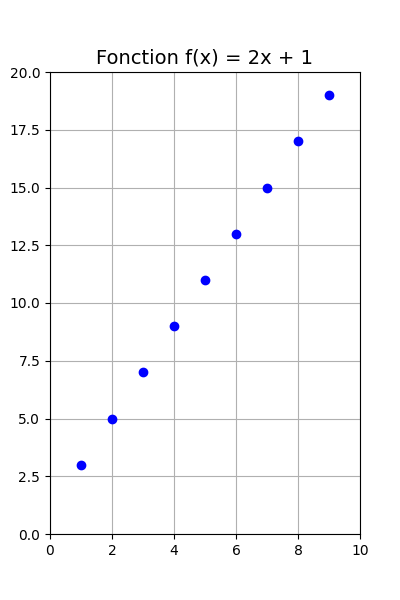

# 12. Boucle `while` avec `pyplot`

Voici un exemple complet pour dessiner les points de la fonction $f(x) = 2x + 1$ sur une figure 2D en utilisant
`matplotlib.pyplot`. La boucle `while` incrémente $x$ de 1 à chaque itération jusqu'à ce que $f(x) > 20$.


### Code Python

```python
import matplotlib.pyplot as plt

# Initialisation de la figure
plt.figure(figsize=(4, 6))

# Définir la fonction f(x)
def f(x):
    return 2 * x + 1

# Initialisation de x
x = 1

# Boucle pour dessiner les points tant que y <= 20
while f(x) <= 20:
    y = f(x)
    plt.plot(x, y, "ob")  # Dessiner le point (x, y)
    x += 1

# Ajouter des labels et un titre
plt.title("Fonction f(x) = 2x + 1", fontsize=14)
plt.xlim(0, 10)
plt.ylim(0, 20)

# Afficher la grille et la figure
plt.grid(True)
plt.show()
```




-------

??? info "Utilisation de l'IA"
      Page rédigée en partie avec l'aide d'un assistant IA, principalement à l'aide de Perplexity AI, avec le *LLM*
      **Claude 3.5 Sonnet**. L'IA a été utilisée pour générer des explications, des exemples et/ou des suggestions de
      structure. Toutes les informations ont été vérifiées, éditées et complétées par l'auteur.
      