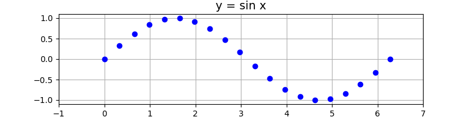

# 17. Fonction `linpspace` avec `pyplot`

Voici un autre exemple de figure comprenant des points calculés à partir d'une fonction, mais dans ce cas-ci en
utilisant la fonction `linspace` de `numpy`.

```python
import numpy as np
import matplotlib.pyplot as plt

# Initialisation de la figure
plt.figure(figsize=(8, 2))

x = np.linspace(0, 2 * np.pi, 20)
y = np.sin(x)

plt.plot(x, y, "ob")

# Ajouter des labels et un titre
plt.title("y = sin x", fontsize=14)
plt.xlim(-1, np.ceil(2 * np.pi))
plt.ylim(-1.1, 1.1)

# Afficher la grille et la figure
plt.grid(True)
plt.show()
```



!!! note "Exercice"

     - Modifiez le format de `"ob"` vers `"-b"` ou `".--b"`. 
     - Diminuez le nombre de points de 20 à 10 ou à 5, ou augmentez-le à 30 our 40.
     - Serait-ce préférable d'utiliser `21` à la place de `20` pour le nombre de points ? Ou `31` à la place de `30` ?
     - Pourquoi n'est-il pas nécessaire de faire une boucle pour dessiner les points dans cet exemple ?

## Explications du code

Ce programme Python utilise les bibliothèques **NumPy** et **Matplotlib** pour tracer une courbe représentant la
fonction $y = \sin(x)$ avec des points espacés régulièrement entre $0$ et $2\pi$.

### Étapes du programme

1. **Importation des bibliothèques** :
    - `numpy` est utilisé pour les calculs numériques, notamment pour générer des valeurs de $x$ et
      calculer $y = \sin(x)$.
    - `matplotlib.pyplot` est utilisé pour créer et personnaliser des graphiques.

2. **Initialisation de la figure** :
    - `plt.figure(figsize=(8, 2))` crée une figure avec une taille personnalisée (8 unités de largeur et 2 unités de
      hauteur).

3. **Création des données** :
    - `np.linspace(0, 2 * np.pi, 20)` génère un tableau contenant 20 valeurs uniformément espacées entre $0$
      et $2\pi$. Ces valeurs représentent les coordonnées $x$.
    - `np.sin(x)` calcule les valeurs correspondantes de $y = \sin(x)$ pour chaque valeur de $x$.

4. **Tracé des points** :
    - `plt.plot(x, y, "ob")` trace les points sur le graphique. Le format `"ob"` signifie :
        - `"o"` : les points sont représentés par des cercles.
        - `"b"` : la couleur des cercles est bleue.

5. **Ajout du titre et personnalisation des axes** :
    - `plt.title("y = sin x", fontsize=14)` ajoute un titre au graphique avec une taille de police de 14.
    - `plt.xlim(-1, np.ceil(2 * np.pi))` définit les limites de l'axe $x$ entre $-1$ et la valeur arrondie à
      l'entier supérieur de $2\pi$.
    - `plt.ylim(-1.1, 1.1)` définit les limites de l'axe $y$ entre $-1.1$ et $1.1$, ce qui permet d'inclure tous
      les points.

6. **Affichage d'une grille** :
    - `plt.grid(True)` ajoute une grille au graphique pour faciliter la lecture des valeurs.

7. **Affichage du graphique** :
    - `plt.show()` affiche le graphique final.

### Résultat

Le programme génère un graphique où :

- Les points bleus représentent les valeurs calculées de $y = \sin(x)$ pour 20 positions de $x$ entre $0$
  et $2\pi$.
- Une grille est affichée pour améliorer la lisibilité.
- Les axes $x$ et $y$ sont ajustés pour inclure tous les points.

L'image attachée montre le résultat attendu : un tracé discret en forme d'onde sinusoïdale avec des points bleus sur un
fond quadrillé.

